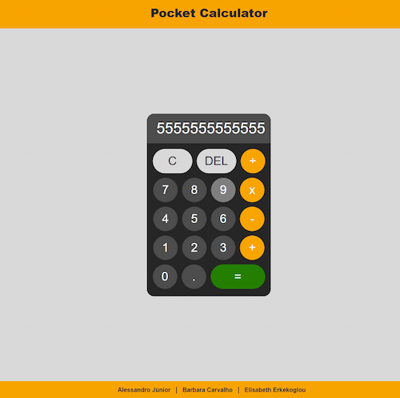
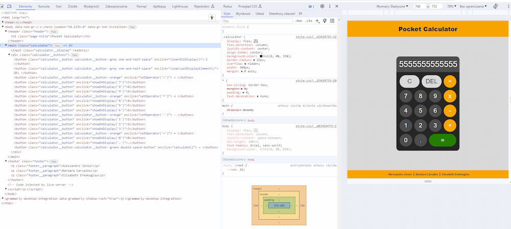

### kreativstorm-project3-calculator
## .png) Pocket Calculator

## Table of contents
  - [Overview](#overview)
  - [The Project](#the-project)
  - [Links](#links)
  - [Screenshots](#screenshots)
  - [Technology stack](#technology-stack)

## Overview

### The Project
A "Pocket Calculator" page with a calculator display performing all of the basic math operations like:
- addition, 
- subtraction, 
- multiplication,
- division.

### Links
- Solution URL: [Github](https://github.com/basiacarvalho/kreativstorm-project3-calculator)
- Live Site URL: [Live demo](https://basiacarvalho.github.io/kreativstorm-project3-calculator/)

### Screenshots

### Technology stack
- HTML
- CSS
- JavaScript